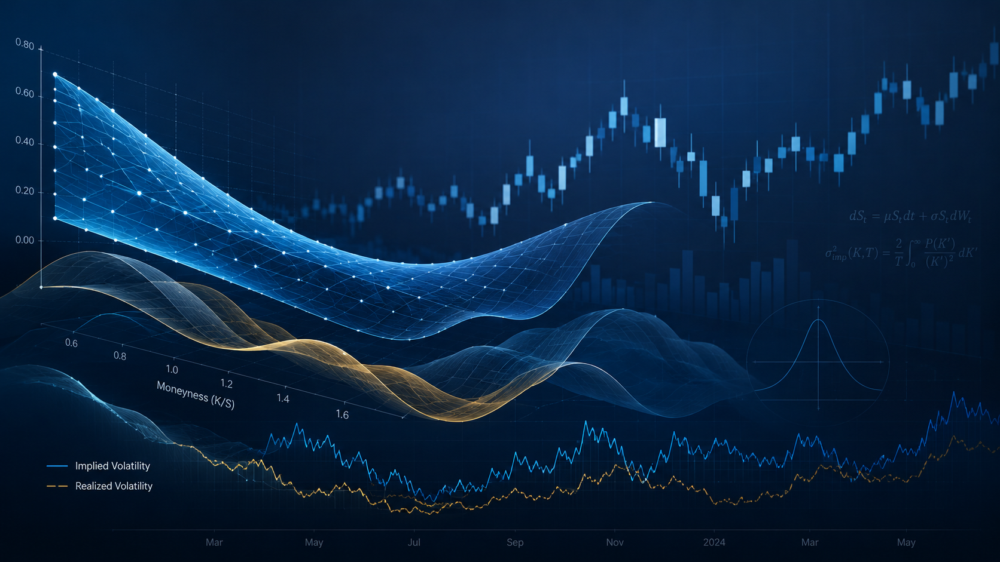
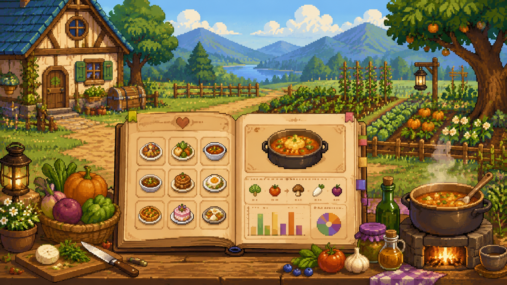
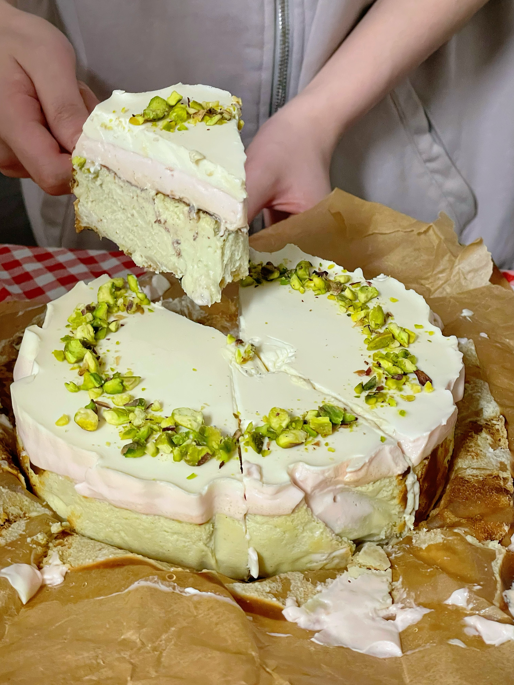
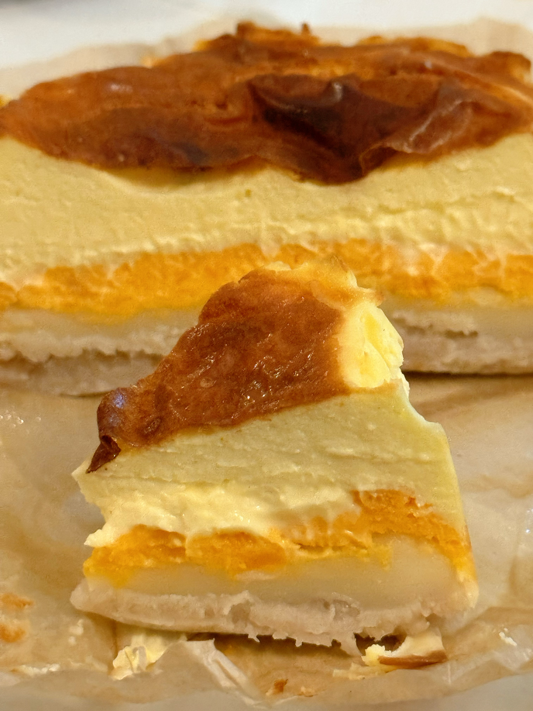
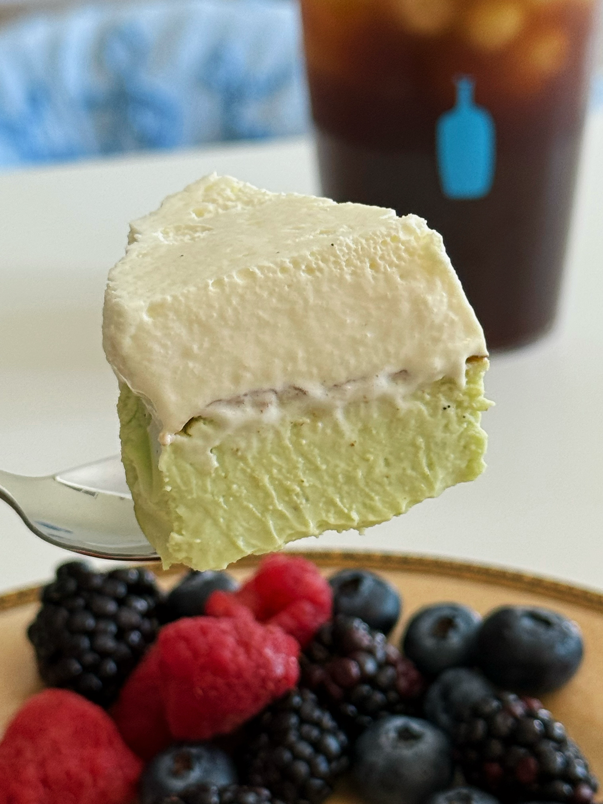
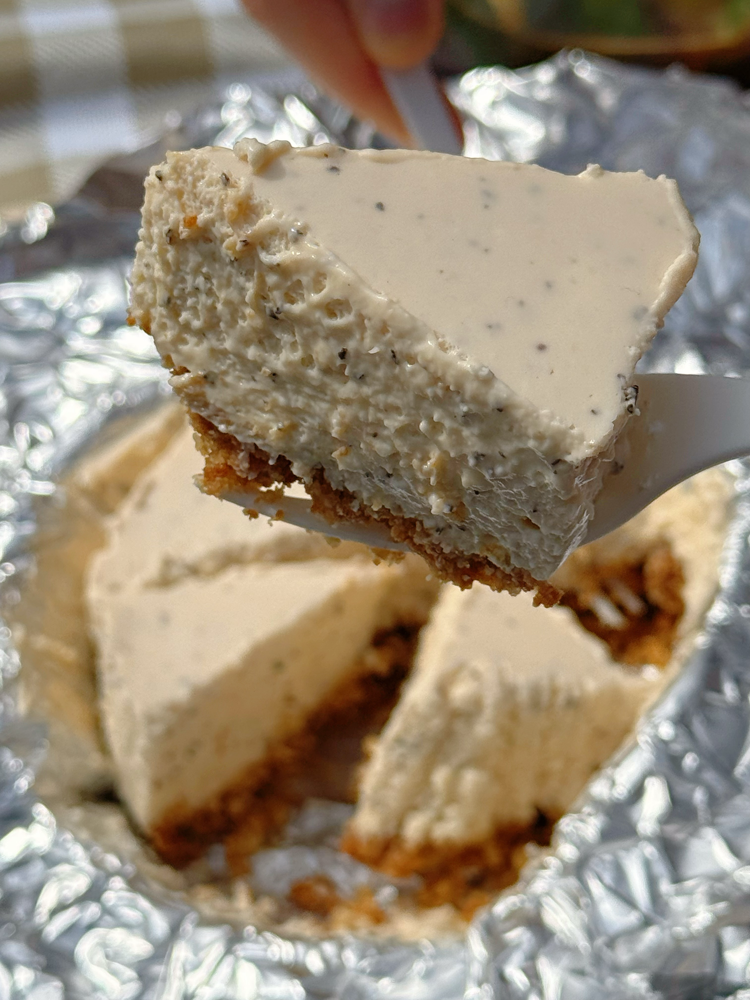
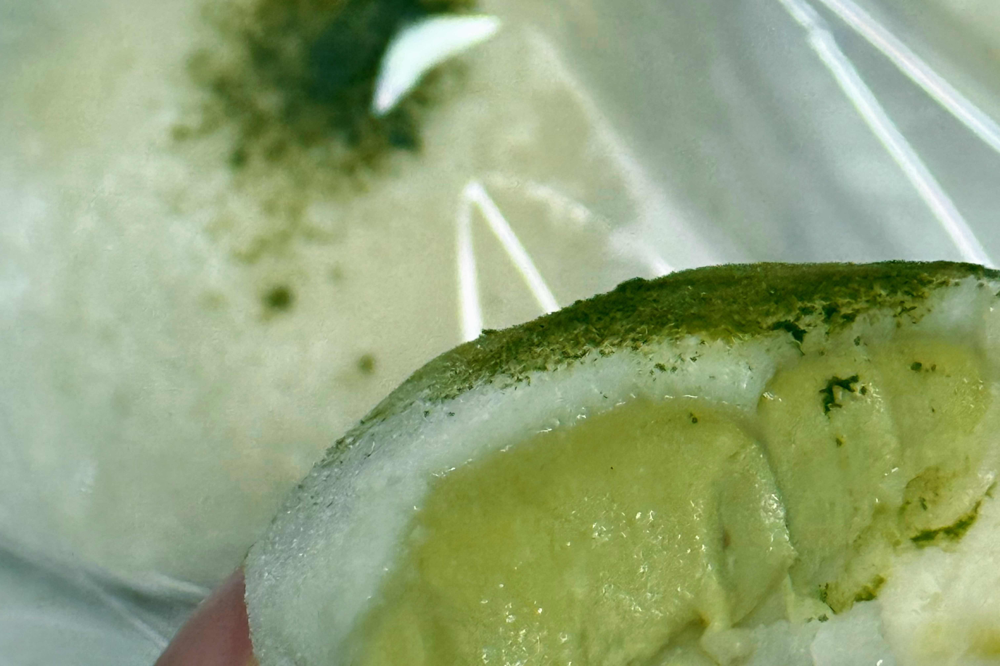
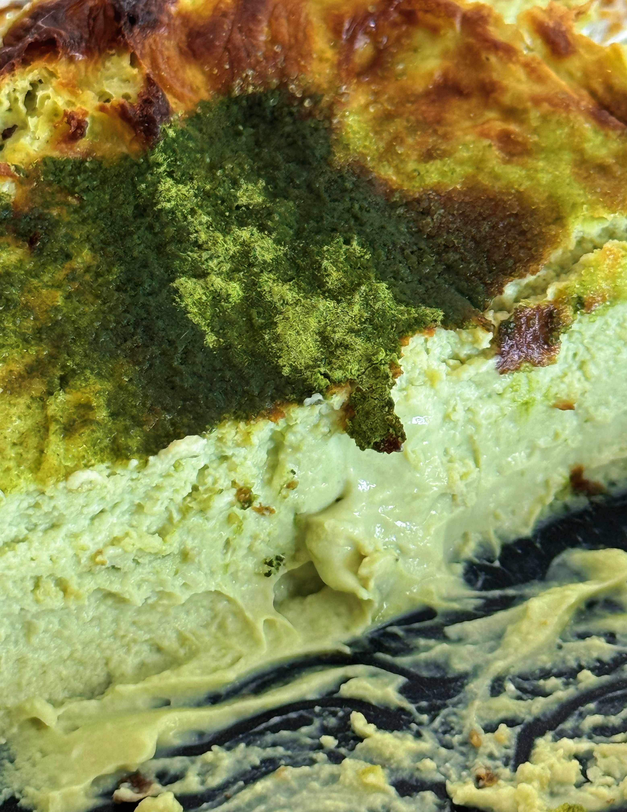
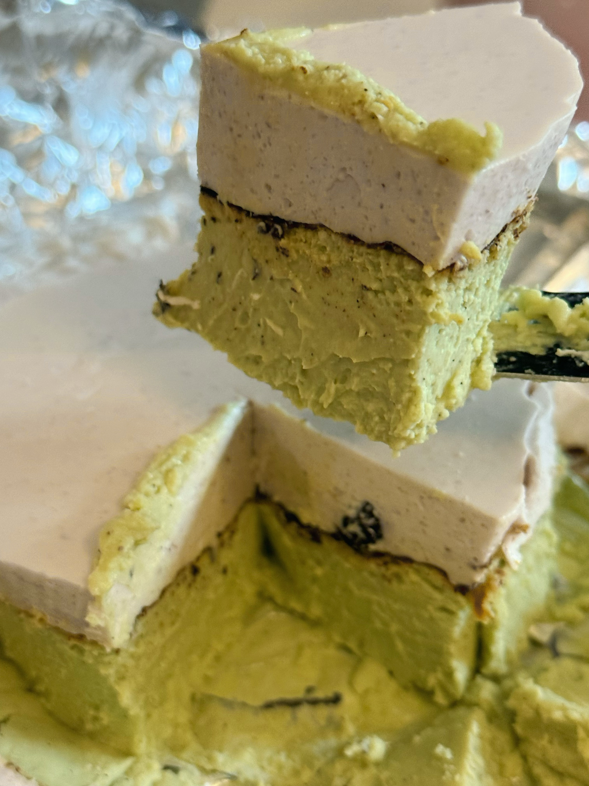

{.profile-image}

# Simeng Wu

### M.S. Student in Statistical Science, Duke University

Statistical Modeling · Bayesian Methods · Applied Machine Learning

I am a Master's student in Statistical Science at <strong>Duke University</strong>. Before Duke, I studied Statistics, Economics, and Finance at <strong>University College London (UCL)</strong>.

My interests span statistical modeling, missing data, Bayesian methods, machine learning, and data-driven decision making. I enjoy projects that combine rigorous statistical thinking with practical implementation.

[View Projects](#projects){.btn .btn-primary .hero-btn}

[View Experience](experience.qmd){.btn .btn-secondary .hero-btn}

[Download CV](files/SimengWu_CV2026.pdf){.btn .btn-outline-dark .hero-btn}

Statistical Modeling · Missing Data · Bayesian Methods · Machine Learning · Quantitative Finance · Risk Management · Data-Driven Decision Making ·

Statistical Modeling · Missing Data · Bayesian Methods · Machine Learning · Quantitative Finance · Risk Management · Data-Driven Decision Making ·

<h1 class="home-projects-title">Projects</h1>

<a href="projects.qmd#short-dated-options-volatility-forecasting-and-trading-strategy">

Volatility Forecasting and Options Trading

</a>

<a href="projects.qmd#chess-anomaly-detection-with-metropolis-hastings-sampling">

Chess Anomaly Detection

</a>

<a href="projects.qmd#web-scraped-recipe-dataset-construction-and-interactive-analysis">

Recipe Dataset and Shiny App

</a>

<a href="projects.qmd#insurance-subrogation-outcome-prediction">

Insurance Subrogation Prediction

</a>

<a href="projects.qmd#momentum-based-algorithmic-trading-strategy">

Momentum-Based Algorithmic Trading Strategy

</a>

<h1 class="education-skills-title">Education & Skills</h1>

Academic training and selected technical tools that support my work in statistical modeling and applied data analysis.

<h2>Education</h2>

2025 - Present

<h3>Duke University</h3>

M.S. in Statistical Science

2022 - 2025

<h3>University College London (UCL)</h3>

B.Sc. in Statistics, Economics and Finance

<h2>Selected Skills</h2>

Programming

Python
R
SQL
Stata
SAS

Statistical Methods

Regression
Time Series
Bayesian Modeling
Machine Learning

Tools

Quarto
Git
Docker
FastAPI
QuantConnect

<h1 class="beyond-work-title">Beyond Work - Baking Moments</h1>

Outside of academic and technical work, I enjoy baking as a slower, hands-on form of creativity. I like the balance between precision and presentation: adjusting small details, working patiently through a process, and seeing how the final result comes together.

<button class="fan-btn fan-btn-left" type="button" onclick="moveFan(-1)">‹</button>

<button class="fan-btn fan-btn-right" type="button" onclick="moveFan(1)">›</button>

Pistachio · Strawberry · Milk

Click the arrows to browse baking moments.

<h1 class="about-title">About</h1>

My academic background combines statistics, economics, and finance, with a growing focus on statistical modeling for complex real-world data. Through coursework and independent projects, I have worked across time series modeling, Bayesian computation, machine learning, data engineering, and applied analytics.

I am particularly drawn to problems where statistical methodology and implementation need to work together. I enjoy turning open-ended questions into structured analytical workflows: defining the target, building reproducible pipelines, comparing models carefully, and communicating results through reports, visualizations, and interactive tools.

Beyond technical work, I have long been interested in writing and visual communication. In high school, I founded and managed a bilingual history-focused WeChat account that grew to over 8,000 followers. This experience helped me develop a stronger sense of audience, structure, and storytelling when communicating complex ideas.

✉
<a href="mailto:sw701@duke.edu">sw701@duke.edu</a>

GH
<a href="https://github.com/SimengWu17">GitHub</a>

in
<a href="https://www.linkedin.com/in/simeng-wu">LinkedIn</a>

CV
<a href="files/SimengWu_CV2026.pdf">Curriculum Vitae</a>

© 2026 Simeng Wu · M.S. Statistical Science, Duke University. Built with Quarto, HTML, and CSS.

Last updated May 2026

